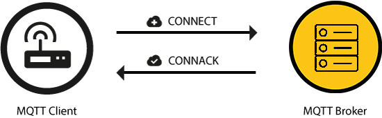
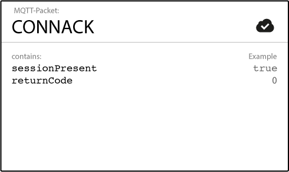

## Introduction to MQTT Client and MQTT Broker

Because MQTT decouples the publisher from the subscriber, client connections are always handled by a broker. Before we get into the details of these connections, let’s be clear about what we mean by client and broker.

### **Client**

When we talk about a client, we almost always mean an MQTT client. Both publishers and subscribers are MQTT clients. The publisher and subscriber labels refer to whether the client is currently publishing messages or subscribed to receive messages (publish and subscribe functionality can also be implemented in the same MQTT client). **An MQTT client is any device (from a micro controller up to a full-fledged server) that runs an MQTT library and connects to an MQTT broker over a network.** For example, the MQTT client can be a very small, resource-constrained device that connects over a wireless network and has a bare-minimum library. The MQTT client can also be a typical computer running a graphical MQTT client for testing purposes. Basically, any device that speaks MQTT over a TCP/IP stack can be called an MQTT client. The client implementation of the MQTT protocol is very straight forward and streamlined. The ease of implementation is one of the reasons why MQTT is ideally suited for small devices. **MQTT client libraries are available for a huge variety of programming languages. For example, Android, Arduino, C, C++, C#, Go, iOS, Java, JavaScript, and .NET.** You can see a complete list on the MQTT wiki.

### **Broker**

The counterpart of the MQTT client is the MQTT broker. The broker is at the heart of any publish/subscribe protocol. Depending on the implementation, a broker can handle up to millions of concurrently connected MQTT clients.

**The broker is responsible for receiving all messages, filtering the messages, determining who is subscribed to each message, and sending the message to these subscribed clients.** The broker also holds the session data of all clients that have persistent sessions, including subscriptions and missed messages. Another responsibility of the broker is the authentication and authorization of clients. Usually, the broker is extensible, which facilitates custom authentication, authorization, and integration into backend systems. Integration is particularly important because the broker is frequently the component that is directly exposed on the internet, handles a lot of clients, and needs to pass messages to downstream analyzing and processing systems. As discussed subscribing to all message is not really an option. In brief, the broker is the central hub through which every message must pass. Therefore, **it is important that your broker is highly scalable, integratable into backend systems, easy to monitor, and (of course) failure-resistant.**

## MQTT Connection

The MQTT protocol is based on TCP/IP. Both the client and the broker need to have a TCP/IP stack.

The MQTT connection is always between one client and the broker. Clients never connect to each other directly. To initiate a connection, **the client sends a CONNECT message to the broker. The broker responds with a CONNACK message** and a status code. Once the connection is established, the broker keeps it open until the client sends a disconnect command or the connection breaks.

### **MQTT connection through a NAT**

In many common use cases, the MQTT client is located behind a router that uses network address translation (NAT) to translate from a private network address (like 192.168.x.x, 10.0.x.x) to a public facing address. As we already mentioned, the MQTT client initiates the connection by sending a CONNECT message to the broker. Because the broker has a public address and keeps the connection open to allow bidirectional sending and receiving of messages (after the initial CONNECT), there is no problem at all with clients that are located behind a NAT.

### **Client initiates connection with the CONNECT message**

Now let’s look at the MQTT CONNECT command message. To initiate a connection, the client sends a command message to the broker. If this CONNECT message is malformed (according to the MQTT specification) or too much time passes between opening a network socket and sending the connect message, the broker closes the connection. This behavior deters malicious clients that can slow the broker down. **A good-natured MQTT 3 client sends a connect message with the following content** (among other things):

Some information included in a CONNECT message is probably more interesting to implementers of an MQTT library rather than to users of that library. For all the details, have a look at the MQTT 3.1.1 specification.

We will focus on the following options:

### **ClientId**
The client identifier (ClientId) **identifies each MQTT client** that connects to an MQTT broker. The broker uses the ClientId to identify the client and the current state of the client.Therefore, this Id should be unique per client and broker. In MQTT 3.1.1 you can send an empty ClientId, if you don’t need a state to be held by the broker. The empty ClientId results in a connection without any state. In this case, the clean session flag must be set to true or the broker will reject the connection.

### **Clean Session**
The clean session flag tells the broker whether the client wants to establish a persistent session or not. In a persistent session (CleanSession = false), the broker stores all subscriptions for the client and all missed messages for the client that subscribed with a Quality of Service (QoS) level 1 or 2. If the session is not persistent (CleanSession = true), the broker does not store anything for the client and purges all information from any previous persistent session.

### **Username/Password**
MQTT can send a **user name and password for client authentication and authorization.** However, if this information isn’t encrypted or hashed (either by implementation or TLS), the password is sent in plain text. We highly recommend the use of user names and passwords together with a secure transport.

### **Will Message**
The last will message is part of the Last Will and Testament (LWT) feature of MQTT. **This message notifies other clients when a client disconnects ungracefully.** When a client connects, it can provide the broker with a last will in the form of an MQTT message and topic within the CONNECT message. If the client disconnects ungracefully, the broker sends the LWT message on behalf of the client. 

### **KeepAlive**
The keep alive is **a time interval in seconds** that the client specifies and communicates to the broker when the connection established. This interval defines the longest period of time that the broker and client can endure without sending a message. The client commits to sending regular PING Request messages to the broker. The broker responds with a PING response. This method allows both sides to determine if the other one is still available. 

Basically, that is all the information that is all you need to connect to an MQTT broker from an MQTT 3.1.1 client. Individual libraries often have additional options that you can configure. For example, the way that queued messages are stored in a specific implementation.

### **Broker response with a CONNACK message**
When a broker receives a CONNECT message, it is obligated to respond with a CONNACK message.

The CONNACK message contains two data entries:

* The session present flag
* A connect return code

### **Session Present flag**
The s**ession present flag tells the client whether the broker already has a persistent session available from previous interactions with the client.** When a client connects with Clean Session set to true, the session present flag is always false because there is no session available. If a client connects with Clean Session set to false, there are two possibilities: If session information is available for the clientId. and the broker has stored session information, the session present flag is true. Otherwise, if the broker does not have any session information for the clientId, the session present flag is false. This flag was added in MQTT 3.1.1 to help clients determine whether they need to subscribe to topics or if the topics are still stored in a persistent session.

### **Connect return code**
The second flag in the CONNACK message is the connect acknowledge flag. This flag contains **a return code that tells the client whether the connection attempt was successful or not.**

Here are the return codes at a glance:

Return Code | Return Code Response 
--     | -- 
0 | Connection accepted
1 | Connection refused, unacceptable protocol version
2 | Connection refused, identifier rejected
3 | Connection refused, server unavailable
4 | Connection refused, bad user name or password
5 | Connection refused, not authorized

For a more detailed explanation of each of these codes, see the [MQTT specification](http://docs.oasis-open.org/mqtt/mqtt/v3.1.1/os/mqtt-v3.1.1-os.html#_Toc398718035).

