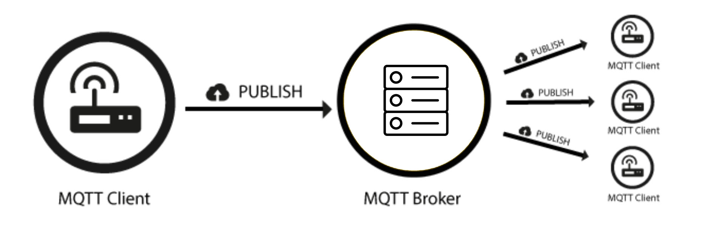
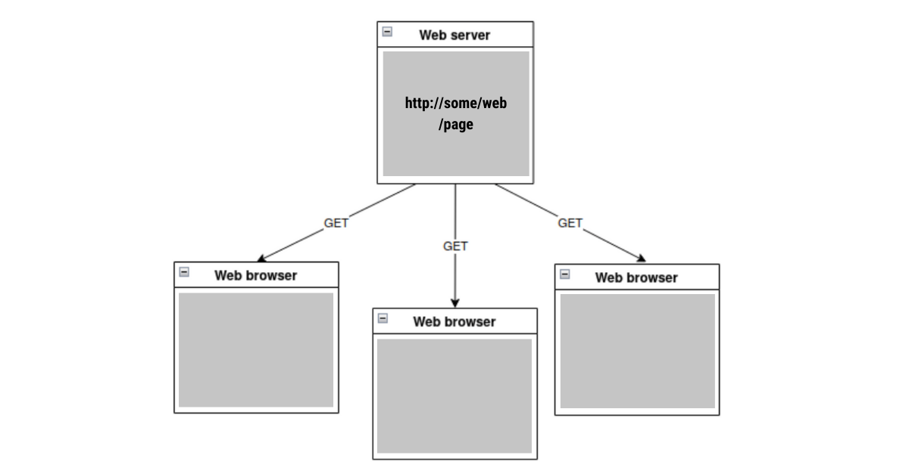
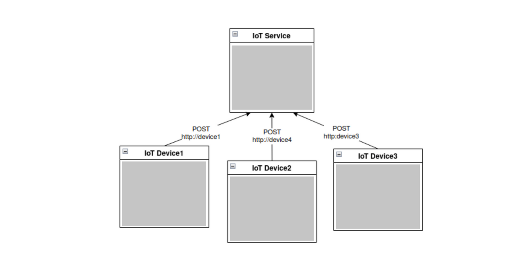

# MQTT vs HTTP(s) for IoT

## MQTT vs. HTTP: Understanding the Differences

MQTT was designed for the Internet of Things (although it wasn’t called that at the time) whereas HTTP was created to make documents available across the internet. **They both run over `TCP` connections, and are both client-server in architecture, but `MQTT` allows messages to pass in both directions between clients and servers whereas `HTTP` servers only respond to requests from clients.** Once an MQTT connection is established, any number of messages can be sent through it in both directions, data from sensor to back-end, and commands the other way. HTTP deals with requests one at a time, with overhead such as authentication being carried out each time. HTTP does have some ability to pool TCP connections, but the overhead for each message remains. MQTT message payloads are binary, whereas HTTP are textual so that binary data needs to be base64 encoded

## What is MQTT?
MQTT is a communication protocol with features specifically targeted at IoT solutions:

* Uses TCP connections, for reliability (assured delivery and packet error checking), fragmentation and ordering.
* Aims to minimize data overhead of each MQTT packet.
* The last known good data value for a device can be stored (retained messages).
* Notifications when client unexpectedly disconnects (will message) to allow client state to be monitored.
* Bi-directional message flow - data from and commands to devices can use the same TCP connection.
* Publish subscribe routing, which allows the easy addition of more consumers and producers of data.

_MQTT Publish / Subscribe Architecture_

The `MQTT` commands are **CONNECT**, **SUBSCRIBE**, **PUBLISH**, **UNSUBSCRIBE** and **DISCONNECT**. `MQTT` Topics are the unit of distribution, to which clients can **PUBLISH** and **SUBSCRIBE**. All authorized subscribers to a topic will receive all messages published to it. `MQTT` topics do not have to be predefined: applications can create them simply by using them.

## What is HTTP?
`HTTP` (_HyperText Transfer Protocol_) was invented as a component of the **W**orld **W**ide **W**eb to transfer documents. It is most familiar to us as one of the enabling technologies that allows web browsers to work. Servers contain resources that are identified by the **URLs** that have the basic familiar form:

    https://www.realsolutions.com.tr/#/home

to which `HTTP` clients can make requests: **GET**, **PUT**, **DELETE** and **POST**, to name the most common. In a normal web environment the simple model is a web browser retrieving web pages from a server with the GET method:

_HTTP GET Method_

---
In an IoT environment, a common use of `HTTP` is to allow devices to **POST** to a resource that represents the device state on the IoT service:

_HTTP protocol in IoT_

---

## MQTT and HTTP Comparison Summary

Başlık | MQTT   |   HTTP
--     | --     | --
Full name | 	MQTT (the OASIS standardization group decided it would not stand for anything)   | Hyper Text Transfer Protocol
Architecture | Publish subscribe (MQTT does have a request/reply mode as well)   |   Request response
Command targets | Topics	| URIs
Underlying Protocol | TCP/IP | TCP/IP
Secure connections | TLS + username/password (SASL support possible)| TLS + username/password (SASL support possible)
Client observability |  Known connection status (will messages) | Unknown connection status
Messaging Mode | Asynchronous, event-based | Synchronous
Message queuing | The broker can queue messages for disconnected subscribers | Application needs to implement
Message overhead |  2 bytes minimum. Header data can be binary | 8 bytes minimum (header data is text - compression possible)
Message Size | 256MB maximum | No limit but 256MB is beyond normal use cases anyway.
Content type | 	Any (binary) | Text (Base64 encoding for binary)
Message distribution | One to many | 	One to one
Reliability | Three qualities of service: **0** - fire and forget, **1** - at least once, **2** - once and only once | Has to be implemented in the application

## MQTT Performance vs HTTP Performance in IoT

There are many different ways of measuring performance, one example, which compares `MQTT` and `HTTP` methods of connecting to Google IoT Core. First of all, `TCP` message overhead

Başlık | MQTT Bytes  |   HTTP Bytes
--     | --          | --
Establish connection |  5572 | 2261
Disconnect | 376 (optional) | 0
For each message published | 388 | 3285
Sum for 1 message |  6336 | 5546
Sum for 10 messages | 9829 | 55,460
Sum for 100 messages | 44,748 | 554,600

The connection establishment figure for `MQTT` is larger because of the **MQTT CONNECT** packet exchange after the `TCP` connection is completed. The equivalent “`overhead`” for `HTTP` has to be included with every request which is why the per message overhead is much bigger.

The `MQTT` disconnect overhead shown here can in fact be 0, as it is not compulsory to send a **DISCONNECT** packet before closing the `TCP` connection.

Next, response times:

No. messages in a connection cycle for MQTT | MQTT avg. response time per message (ms) (QoS 1)  |   HTTP avg. response time per message (ms)
--     | --          | --
1|113|289
100|47|289
1000|43|289

The reduction in response time as we send more messages during a single `TCP` connection is expected, as we do not incur the connection setup overhead for each message. `HTTP` does not have that ability - some approaches such as caching or connection pooling can improve response times and overhead but not to the extent to match `MQTT`.

These measurements are made using `MQTT` **QoS** (_Quality of Service_) 1, waiting for the acknowledgment each time before sending the next message. The performance can be improved by sending subsequent messages before receiving the preceding acknowledgment (at the cost of some coding complexity), or using `QoS 0`, which does not require an acknowledgment (at the cost of some reliability).

To illustrate the extra relative throughput and response times possible using `QoS 0` vs `QoS 1`, these are figures obtained with a local HiveMQ broker, using a round-trip scenario (one message received on a subscription for each message published):

No. messages | MQTT QoS  |   Messages per second | Avg. round trip time (ms)
--     | --          | -- | --
10000 | 1 | 1234 | 0.81
10000 | 0 | 18416| 0.054

## The Advantages and Disadvantages of MQTT in IoT

A minor disadvantage of `MQTT` compared with HTTP is in the cost of connection setup. If only one message is being sent in each `TCP` session, then this overhead can be greater than HTTP. This is not the normal scenario for IoT, however, and where multiple messages are sent and received in the same `TCP` session, `MQTT`’s advantage quickly grows. One of the greatest attributes of `MQTT` is the flexibility with which solutions can be created. The publish-subscribe paradigm allows many clients to produce and share information with each other as well as back-end systems. Brokers can be chained together, and `MQTT` gateways connected to cloud services just by mapping the flow of messages through topics. Over the air updates of firmware and configurations can be broadcast to devices. The inbuilt queueing of `MQTT` brokers can deal with connection interruptions and provide buffering for constrained devices that don’t have the capacity to do it themselves.

## The Advantages and Disadvantages of HTTP in IoT
The principal advantage of `HTTP` for use in IoT is its familiarity to developers, many of whom have implemented web solutions of one kind or another. A consequence of this is the availability of client libraries and servers. However, `MQTT` is not far behind these days, a search for `MQTT` software will show up lots of options including HiveMQ’s open source software. `HTTP` has no equivalent of many `MQTT` features that are useful for IoT such as queuing, QoS, retained messages and message push.

## MQTT vs. HTTP – Which is Better for IoT?

As `MQTT` was designed for IoT solutions it fits many more IoT scenarios than `HTTP`. The only case where `HTTP` might be a valid choice is to connect devices which already have an `HTTP` client installed to a provider which has an `HTTP` option. But then only for low volume data transmission, and without the option of sending control commands to the device.